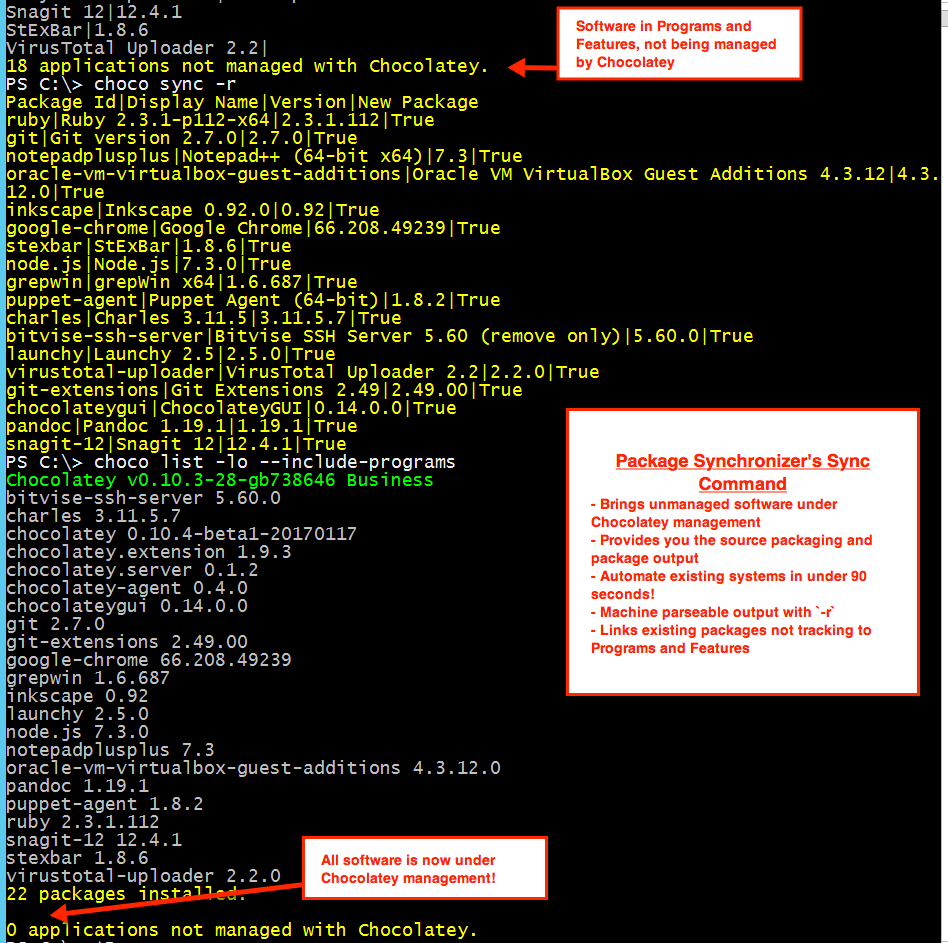

# Synchronize with Programs And Features (Licensed Editions Only)

Chocolatey maintains its own state of the world, while Windows maintains the state of Programs and Features. If an application is upgraded or uninstalled outside of Chocolatey, such as is the case with Google Chrome and its auto updating utility, Chocolatey open source doesn't know about the change. The synchronize features in licensed editions keep Chocolatey's state in sync with Programs and Features, removing possible system-installed state drift.

* [Automatic Sync (All Licensed Editions)](#automatic-synchronize)
* [Synchronize Command](#sync-command) (currently Business edition only - check https://chocolatey.org/compare#compare for availability)
* [All Packages in Programs And Features (C4B)](#all-packages-in-programs-and-features)

---

<!-- TOC -->

- [Automatic Synchronize](#automatic-synchronize)
  - [Usage](#usage)
    - [Automatic Updating Software?](#automatic-updating-software)
    - [More Details On External Upgrades](#more-details-on-external-upgrades)
  - [See It In Action](#see-it-in-action)
  - [Options and Switches](#options-and-switches)
  - [FAQ](#faq)
    - [How do I take advantage of this feature?](#how-do-i-take-advantage-of-this-feature)
    - [I'm a licensed customer, now what?](#im-a-licensed-customer-now-what)
    - [How does it work?](#how-does-it-work)
- [Sync Command](#sync-command)
  - [Usage](#usage-1)
    - [Setup](#setup)
  - [See it in action](#see-it-in-action)
  - [Options and Switches](#options-and-switches-1)
  - [FAQ](#faq-1)
    - [How do I take advantage of this feature?](#how-do-i-take-advantage-of-this-feature-1)
    - [I'm a business customer, now what?](#im-a-business-customer-now-what)
    - [How does it work?](#how-does-it-work-1)
    - [Do I get the packages to add to source?](#do-i-get-the-packages-to-add-to-source)
    - [Some packages have a TODO list](#some-packages-have-a-todo-list)
    - [How do I get machine parseable output?](#how-do-i-get-machine-parseable-output)
    - [What if I have an existing package that is just not tracking to Programs and Features?](#what-if-i-have-an-existing-package-that-is-just-not-tracking-to-programs-and-features)
  - [Sync Command Known issues](#sync-command-known-issues)
- [All Packages in Programs and Features](#all-packages-in-programs-and-features)
  - [Usage](#usage-2)
  - [Requirements](#requirements)
  - [Setup](#setup-1)
  - [Options and Switches](#options-and-switches-2)
  - [FAQ](#faq-2)
    - [How do I take advantage of this feature?](#how-do-i-take-advantage-of-this-feature-2)
    - [I'm a business customer, now what?](#im-a-business-customer-now-what-1)
    - [How does it work?](#how-does-it-work-2)
  - [Packages in Programs and Features Known Issues](#packages-in-programs-and-features-known-issues)

<!-- /TOC -->

## Automatic Synchronize
In all licensed editions, Chocolatey syncs the state of ***already installed Chocolatey packages*** (nupkg files) to the state of the software they are linked up with - so if the software is uninstalled or upgraded outside of Chocolatey, it removes the package or notes the upgrade. This behavior is known as automatic synchronization or autosync for short. There is also choco sync, which is different and is covered in [Sync Command](#sync-command) below.

There is an important distinction between packages and software to understand with Chocolatey. Chocolatey manages packages (nupkg files), and packages manage software. Many packages are what we call "installer packages" - packages that manage an installer and an installation into Programs and Features. Once that software is in Programs and Features, it could be manipulated outside of Chocolatey. If it is removed without the command going through Chocolatey, open source Chocolatey will still have the package installed (which is technically correct from a package manager state, but incorrect based on expectations). With open source you end up with a disconnect if you are not careful. Licensed editions of Chocolatey are able to see system state and correct this discrepancy with autosync by updating the state of the package based on what has occurred outside of Chocolatey.

For software management, which encompasses package management and above that for Windows, the state of the software is really what should be reflected with those installed packages. So if that software has been uninstalled from Programs and Features or upgraded outside of Chocolatey, autosync removes those packages to match that state or notes the upgrade (note it doesn't change the version of the package - that's much trickier to get correct).

As commercial editions lean more towards software management, they have much better system integration. Autosync is great for ensuring that Chocolatey matches the state of changes on the system for what the packages it is tracking.

### Usage

In the image above, someone manually removed the 1Password software. On the next run of Chocolatey, auto sync sees the software has been removed, so it removes the package tracking to that software in response to those system changes.

<!--
Text in the image above:

Synchronize with Programs and Features

- Chocolatey for Business - any Chocolatey command will trigger synchronization
- Synchronizes state between Chocoaltey and Programs and Features
- Currently supports manual software removals
- Adding upgrade tracking

This image shows running `choco list -lo`. Chocolatey for Business automatically detects that 1Password has been manually uninstalled and synchronizes Chocolatey's state.
-->

#### Automatic Updating Software?
When you have software like Google Chrome that automatically updates, it is recommended typically that you pin the package to let the software automatically upgrade. Chocolatey's autosync will track the software updates in the background and store those which will be helpful if you later remove the software from Programs and Features directly or want to run choco uninstall on the package to remove the software.

#### More Details On External Upgrades
You could also upgrade the software directly outside of Chocolatey, which would similarly create a discrepancy between the software being on a newer version than the package shows.

Chocolatey's autosync understands that an upgrade occurred and tracks that for the software, but not the packaging. So you won't see anything visual that indicates the sync as the package version will remain the same.

> :memo: **Why doesn't Chocolatey upgrade the package version?**
>
> There is not always a one to one line up between package version and software version. The version of software you think you are based on the software telling you and what that software reports as the version in the registry are different many times, unfortunately. This makes it very difficlt to update a package version correctly.

For example, for the longest time Google Chrome had a version number in the registry at 65.x when the version being displayed to users was at like 59.x. The packaging was at 59.x following what people note as the version based on what Google Chrome tells them. This is just one of many examples.

> :memo: **Software version tracking assists in uninstallations where Chocolatey's autouninstaller is invoked.**

If the software is an MSI, the Product Guid is used for managing uninstalls. Guess what typically changes on every upgrade? Yes, the Product Guid. So autosync is keeping track of the new ones as the software automatically upgrades. Without tracking that, if you were to say `choco uninstall googlechrome` without autosync and there was no `chocolateyUninstall.ps1` in the package, then the software could potentially be left on the system because Chocolatey's automatic uninstaller wouldn't have the right Product Guid and thus be unable to handle software uninstallation.

### See It In Action

> :memo: **NOTE**: To see all feature videos for Chocolatey for Business, please visit https://chocolatey.org/resources/features#c4b.

### Options and Switches
There are none - automatic sync just happens every run.

### FAQ
#### How do I take advantage of this feature?
You must have a [licensed edition of Chocolatey](https://chocolatey.org/pricing) (Pro, MSP, or Business). Pro is a personal, named license that costs about the price of a lunch outing per month and comes with several other features. Business editions are great for organizations that need to manage the total software management lifecycle. MSP editions contain a subset of the Business edition features.

#### I'm a licensed customer, now what?
It just works.

#### How does it work?
Chocolatey tracks applications that it installs, so it is able to keep up with those applications as they are upgraded and uninstalled, even outside of Chocolatey.

## Sync Command

Starting in 1.9.0 of the licensed extension, sync has been added as a preview feature for organizations to try out. Currently Business edition only, but expected to be in Pro+ at some point - check https://chocolatey.org/compare#compare for availability.

Sync looks at all software that is in Programs and Features that is not being managed with Chocolatey packages and brings them under management. This means you can run one command and suddenly, all of the software installed on a machine is under management by Chocolatey!

### Usage
To synchronize your system, Simply call `choco sync` and Chocolatey will ensure that all software in Programs and Features comes under Chocolatey management and provides you the packages/package sources so you can add them to source control for managing those packages over time.

#### Setup
At 1.9.0, sync is in preview. You need to turn it on by enabling the feature  `allowPreviewFeatures`:

* `choco feature enable -n allowPreviewFeatures`

### See it in action
We've prepared a short video to show sync in action:

> :memo: **NOTE**: To see all feature videos for Chocolatey for Business, please visit https://chocolatey.org/resources/features#c4b.

In the following image, sync is run on a system that has 18 applications installed and a base Chocolatey for Business install. Note after running sync, all software on the machine is now being managed by Chocolatey.

<!--
Text in the image above:

Package Synchronizer's Sync Command

- Brings unmanaged software under Chocolatey management
- Provides you the source packaging and package output
- Automate existing systems in under 90 seconds!
- Machine parseable with `-r`
- Links existing packages not tracking to Programs and Features

This image shows running `choco sync`. It shows first a system that has 18 applications installed outside of Chocolatey, then runs `choco sync` and watches Chocolatey generate packages and baseline the system. Then it shows `choco list -lo --include-programs` again, which shows that all software on the machine is now being managed by Chocolatey.

-->

### Options and Switches
The following are available in the [[choco sync|CommandsSync]] command.

~~~
     --id=VALUE
     Id - The Display Name from Programs and Features

     --out, --outdir, --outputdirectory, --output-directory=VALUE
     OutputDirectory - Specifies the directory for the generated Chocolatey
       package file(s). If not specified, uses a subdirectory of the current
       directory.
~~~

### FAQ
#### How do I take advantage of this feature?
You must have the [business edition of Chocolatey](https://chocolatey.org/pricing). Business editions are great for organizations that need to manage the total software management lifecycle.

#### I'm a business customer, now what?
You would periodically run `choco sync`.

#### How does it work?
Chocolatey takes a look at all software in Programs and Features that is not under Chocolatey management, generates packages on the fly and baselines them under the Chocolatey install, ensuring all of the links are tracked.

#### Do I get the packages to add to source?
Yes! Chocolatey will tell you the location of the sync files so you can put them into source control.

#### Some packages have a TODO list
Generating packages on the fly from Programs and Features for non-MSI installers doesn't provide everything necessary to ensure an actual install. So when you take those packages back to source, you will need to finish out the packaging for those so that later when you upgrade, things will work appropriately.

#### How do I get machine parseable output?
Use `-r`. `choco sync -r`. Requires Chocolatey v0.10.4+.

#### What if I have an existing package that is just not tracking to Programs and Features?
Synchronize can recognize existing packages and sync to those as long as the name of the package is a close match to the software name (e.g. Google Chrome becomes either google-chrome or googlechrome).

### Sync Command Known issues
* Any packages you've installed side by side (`-m`) will show up every time during sync.
* If you have both a 64-bit and 32-bit version of some software installed, sync will track to one on the first run and the other on the next run. This is not a normal scenario.

## All Packages in Programs and Features
In C4B, you can flip a switch and see all packages in Programs and Features, even those packages that don't have underlying native installers! This makes reporting back to legacy inventory reporting systems a snap.

### Usage

<!--
Text in the image above:

Package Synchronizer - All Packages in Programs and Features

- All packages show up, even if they don't use a native installer
- Managed automatically by Chocolatey
- Supporting legacy inventory tracking systems is now a snap
- No need to build MSIs for internal software

This image shows a display of `choco list -lo` side by side with Programs and Features. It links a package with a native installer (Launchy) to show that it didn't do anything differently. It links a package that uses a zip archive (Screen To Gif), shows part of the nuspec file and how that all maps to the Programs and Features entry.
-->

### Requirements

* Chocolatey (`chocolatey` package) v0.10.7+.
* Chocolatey for Business (C4B) Edition.
* Chocolatey Licensed Extension (`chocolatey.extension` package) v1.10.0+.

### Setup

* `choco feature enable -n showAllPackagesInProgramsAndFeatures`

### Options and Switches

 Global Feature Setting:

 * `showAllPackagesInProgramsAndFeatures` - Package Synchronizer's Packages In Programs And Features Synchronization - Show all packages in Programs and Features, not just packages that use a native installer.

### FAQ

#### How do I take advantage of this feature?
You must have the [business edition of Chocolatey](https://chocolatey.org/pricing). Business editions are great for organizations that need to manage the total software management lifecycle.

#### I'm a business customer, now what?
Once you set the feature, it just works automatically.

#### How does it work?
Chocolatey tracks packages that manage natively installed software. For packages that are zip archives or configuration, Chocolatey will add an entry into Programs and Features based on the nuspec. It's smart enough not to add an entry for a meta-package - say `notepadplusplus` and `notepadplusplus.install` are installed. The meta-package would be `notepadpluplus`.

### Packages in Programs and Features Known Issues
* MSU type packages will show up - Chocolatey doesn't automatically track Windows Updates types of installers. So if you install WMF 5 through Chocolatey and turn this feature on, it will show up as well.
* You must run choco at least one more time after setting the feature for it to take effect. So flip the feature and then run `choco -v`.
